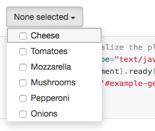
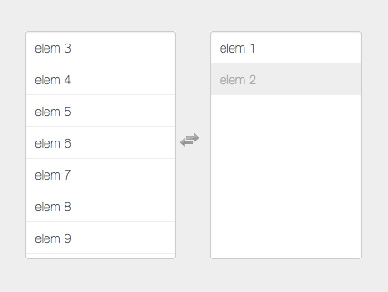

MultiSelect Widget for Yii2
===========================
[](https://packagist.org/packages/2amigos/yii2-multi-select-widget)
[](https://packagist.org/packages/2amigos/yii2-multi-select-widget)
[](https://travis-ci.org/2amigos/yii2-multi-select-widget)
[](//packagist.org/packages/2amigos/yii2-multi-select-widget)  
[](https://scrutinizer-ci.com/g/2amigos/multi-select-widget/?branch=master)

This library contains two of the most useful bootstrap multi-select plugins. One is the  [MultiSelect Bootstrap plugin](http://davidstutz.github.io/bootstrap-multiselect) from David Stutz and the other is 
the [MultiSelect.js plugin](http://loudev.com/) from Loudev.

Installation
------------
The preferred way to install this extension is through [composer](http://getcomposer.org/download/).

Either run

```
php composer.phar require 2amigos/yii2-multi-select-widget "*"
```
or add

```json
"2amigos/yii2-multi-select-widget" : "*"
```

to the require section of your application's `composer.json` file.

Usage for MultiSelect Bootstrap Plugin
--------------------------------------



**Using a model**
 
```
use dosamigos\multiselect\MultiSelect;

<?= $form->field($model, 'attribute')->widget(MultiSelect::className(),[
    'data' => ['super', 'natural'],
]) ?>
```

**Using it as standalone widget**

```
echo MultiSelect::widget([
    'id'=>"multiXX",
    "options" => ['multiple'=>"multiple"], // for the actual multiselect
    'data' => [ 0 => 'super', 2 => 'natural'], // data as array
    'value' => [ 0, 2], // if preselected
    'name' => 'multti', // name for the form
    "clientOptions" => 
        [
            "includeSelectAllOption" => true,
            'numberDisplayed' => 2
        ], 
]);
```

Usage for MultiSelectListBox Bootstrap Plugin
---------------------------------------------



The functionality to use this plugin is actually the same as its an extension of the previous one. The only thing that 
changes its use is its set of configuration options. 

```
use dosamigos\multiselect\MultiSelectListBox;
use yii\web\JsExpression;

<?= $form->field($model, 'attribute')->widget(MultiSelect::className(),[
    'data' => ['super', 'natural'],,
    'clientOptions' => [
        'selectableHeader' => "<input type='text' class='search-input' autocomplete='off' placeholder='try \"12\"'>",
        // yep, events MUST use JsExpression
        'afterInit' => new JsExpression('function(ms){ // ... }')
    ]
]) ?>
```

Further Information
-------------------

I highly recommend you to visit both sites: 

- [MultiSelect Bootstrap plugin](http://davidstutz.github.io/bootstrap-multiselect)
- [MultiSelect.js plugin](http://loudev.com/)


Then, check what are the options that would allow you to create one or the other. I have never used both on the same 
UI and I am not sure whether they can be used together or not. The `MultiSelectListBox` has a different constructor 
function name but very similar (`multiSelect` vs `multiselect`), but we are not sure whether they are compatible or not.  

If you have the experience and willing to share, let us know on the issues and we will update this README file 
accordingly.


Contributing
------------

Please see [CONTRIBUTING](CONTRIBUTING.md) for details.

Credits
-------

- [Antonio Ramirez](https://github.com/tonydspaniard)
- [All Contributors](../../contributors)


License
-------

The BSD License (BSD). Please see [License File](LICENSE.md) for more information.


> [](http://www.2amigos.us)   
<i>Web development has never been so fun!</i>
[www.2amigos.us](http://www.2amigos.us)
